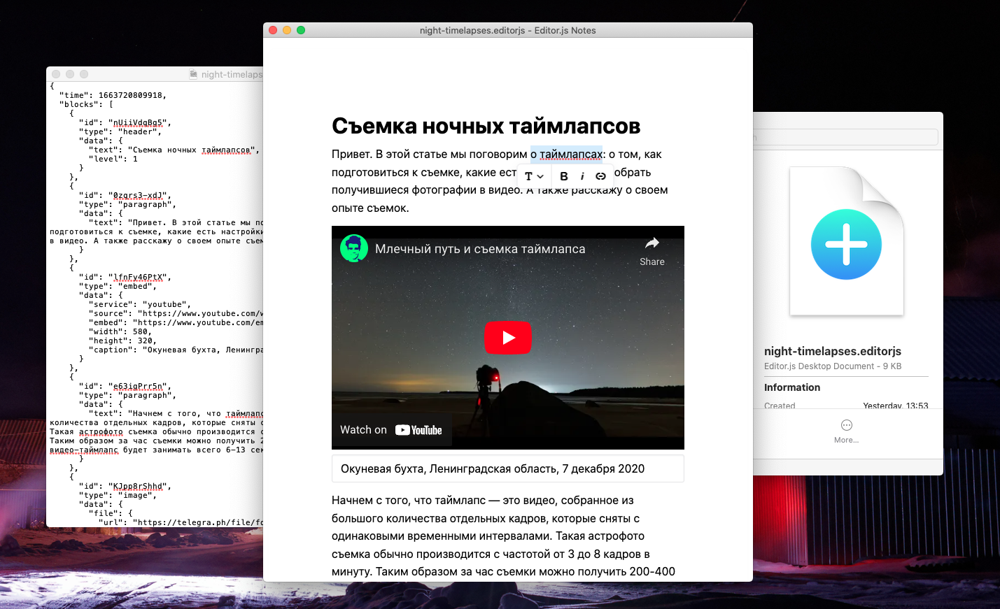

# Editor.js Desktop

Desktop application for editing `.editorjs` documents in [Editor.js](https://editorjs.io) format.

> Work in progress

## Usage

- `Cmd+S` to save
- `Cmd+O` to open
- `Cmd+N` to create a new document

## Development

Clone the repository

```bash
git clone https://github.com/talyguryn/editorjs-desktop
```

Install node deps

```bash
yarn install
```

Run the app

```bash
yarn start
```

Or build the app

```bash
yarn build
```
